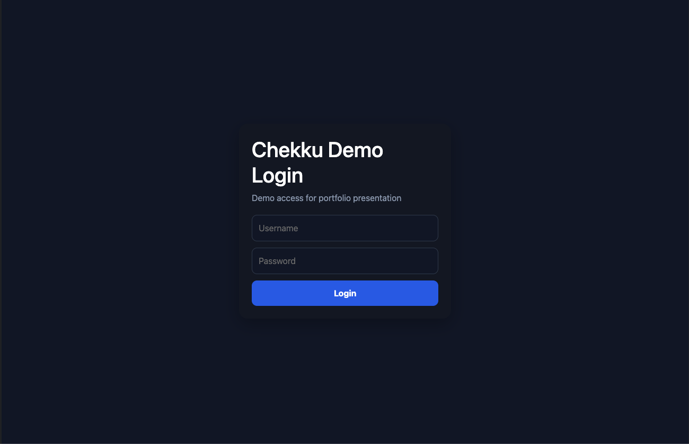
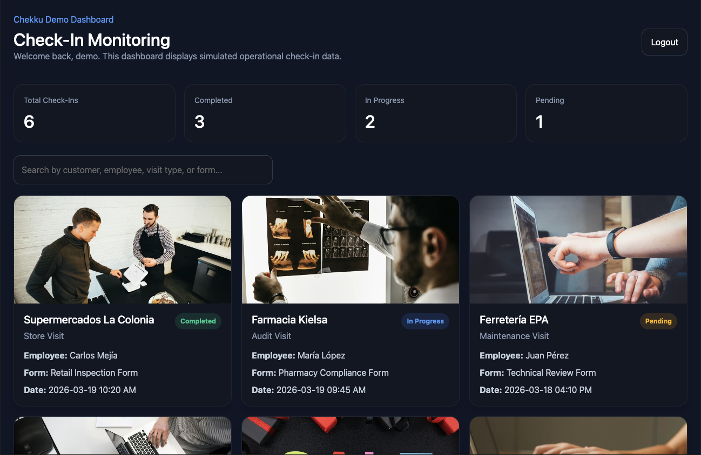

# Chekku Test Dashboard

A React + TypeScript application built as a technical implementation to interact with the Chekku platform API.

The application provides authentication, data fetching, and visualization of check-in records, including customer information and associated media.

---

## 🚀 Features

- User authentication with API integration  
- Token management using localStorage  
- Protected dashboard view  
- Fetch and display paginated check-in data  
- Interactive cards with customer and visit information  
- Image preview using modal component  
- Logout functionality  

---

## 🛠 Tech Stack

- React  
- TypeScript  
- Axios  
- React Router  
- Styled Components  

---

## 🎯 Purpose

This project demonstrates:

- API integration with authentication  
- Handling protected routes and session management  
- Data fetching and transformation  
- Building interactive UI components  
- Working with real-world backend structures  

---

## 📸 Screenshots

### 🔐 Login Screen

### 📊 Dashboard View

## 👨‍💻 Author

Javier Nuñez  
